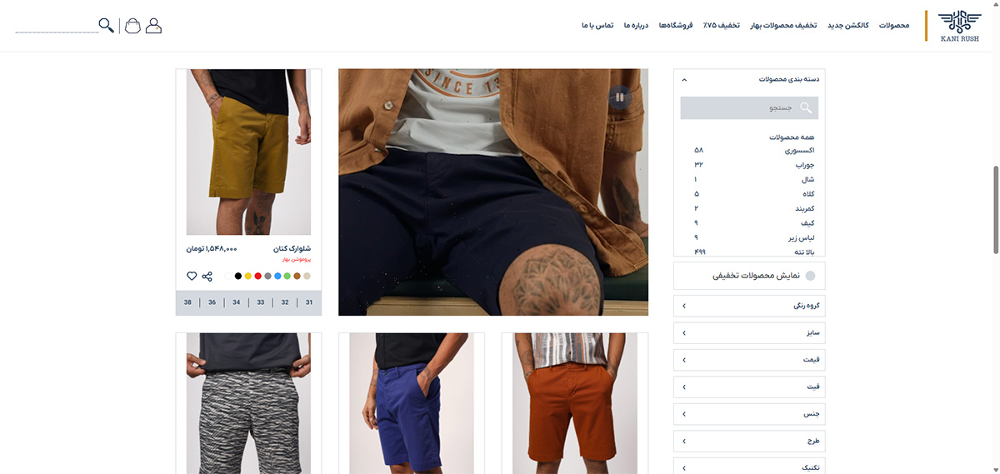
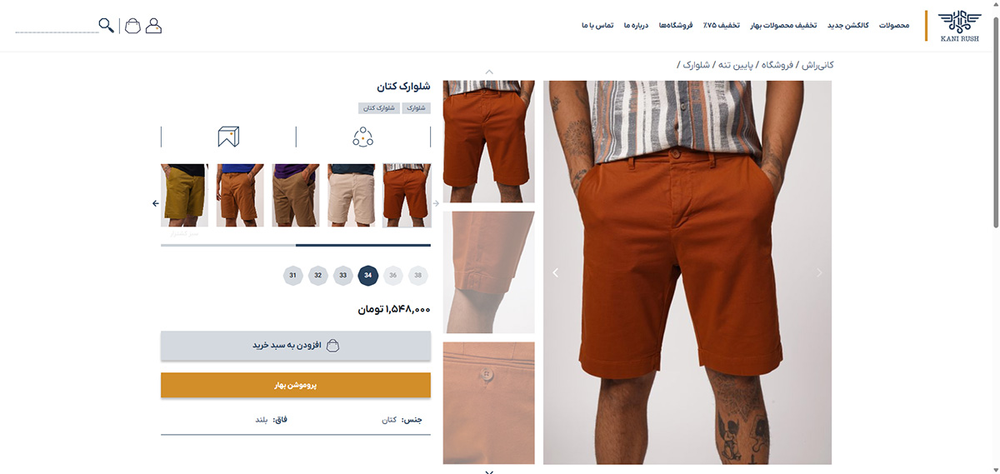
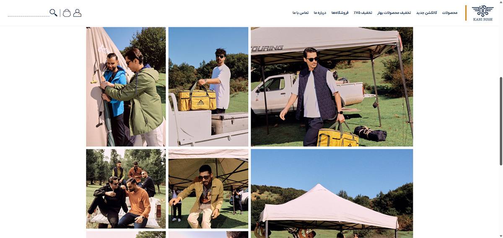
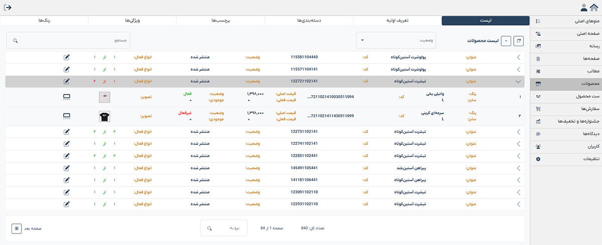
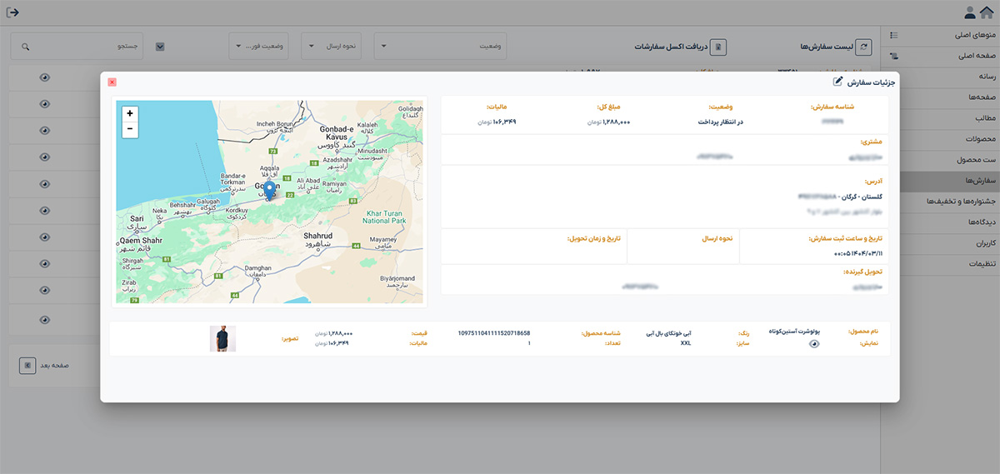
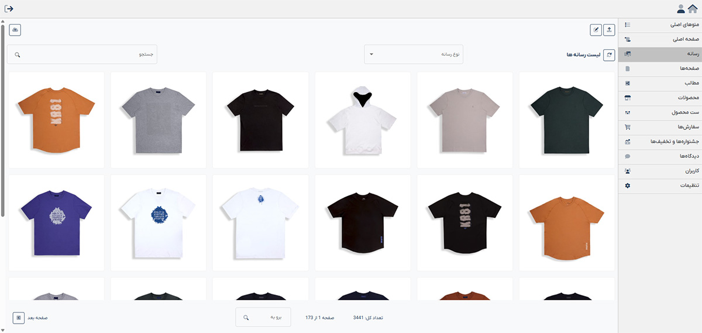

# Kanirush Online Store (Showcase)

This repository showcases the development of a custom e-commerce website for **Kanirush**, a leading Iranian manufacturer of casual menswear.

🔗 **Live Website:** [https://kanirush.com](https://kanirush.com)

---

## 🏢 About the Client

**Kanirush** is a Tehran-based manufacturer of men's casual clothing with multiple retail branches across Iran. Their operations and inventory are managed via the **Rahkaran ERP** system.

---

## ⚙️ Project Overview

The project involved building a highly customized WooCommerce store connected to **Rahkaran ERP** via web services, along with a dedicated **Angular admin panel**.

### 🔗 ERP Integration
- **Product creation** is based on ERP product codes defined by the client.
- **Color and size variations** are mapped using Kanirush’s internal coding logic.
- Real-time **stock and price check** via ERP.
- Every **30 minutes**, a cron job syncs ERP data to the WooCommerce store.
- After an order is placed, an **automated invoice** is generated inside the ERP system.

### 🧩 Admin Panel (Angular)
- Built with Angular for an intuitive and clean admin interface
- Manages:
  - Header & footer menus
  - Homepage content
  - Media & page editor
  - Product images, variations, tags, and categories
  - Orders and user accounts
  - Customer reviews

### 🧑‍💻 Frontend Site
- Fully custom WordPress theme using **PHP** and **jQuery**
- Seamless design and optimized performance

---

## 🧑‍💻 Tech Stack

| Layer         | Tech                        |
|---------------|-----------------------------|
| CMS           | WordPress + WooCommerce     |
| Frontend Site | PHP + jQuery                |
| Admin Panel   | Angular                     |
| Backend API   | Custom PHP (REST)           |
| ERP           | Rahkaran ERP (Web Services) |

---

## 📸 Screenshots

### 🔹 Website Frontend

**Homepage**  

**Shop Page**  

**Product Page**  

**Custom Page**  

---

### 🔹 Admin Panel

**Products Management**  

**Orders Management**  

**Media Library**  

---

## 🔒 Source Code

Due to the proprietary nature of this project, the source code is **not publicly available**. This repository serves as a portfolio **showcase** only.

---

## 👨‍💻 Authors

- **Frontend Website & Backend API:** [Amir Navidfar](https://github.com/amirhsnf)  
- **Admin Panel UI (Angular):** Arman Molaei
